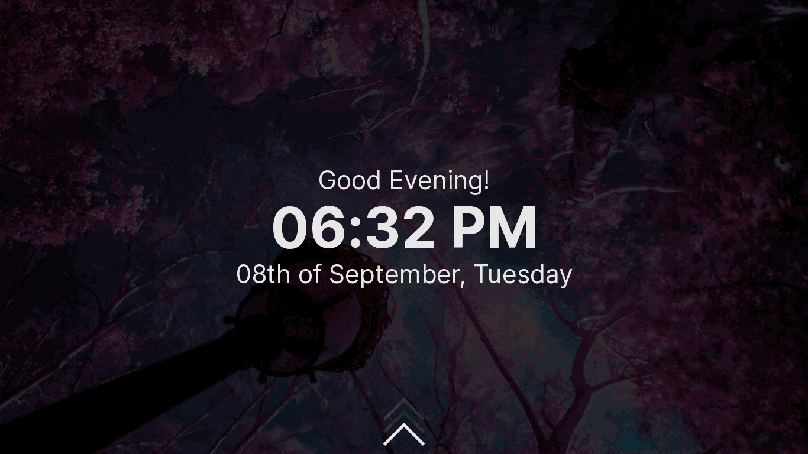

# Lightdm Glorious Theme

A Sleek and Modern theme for the Lightdm display manager using `webkit2-greeter`, made using Vanilla JS and HTML.
This theme works with Mouse, Trackpads, Keyboard, and Touchscreen devices too.

This repository is a fork of https://github.com/manilarome/lightdm-webkit2-theme-glorious

### Features

+ Multi-user support
+ Customization and Settings
+ Keyboard navigation
+ Remappable keybindings
+ Swipe gestures
+ Vanilla Javascript!

## See the [Live Demo](https://thegamerhat.github.io/lightdm-glorious-webkit2/)

### Demo password: `toor`

<p align='center'><br/><i>LightDM Glorious Theme</i></p>

### Dependencies

Please make sure you have a recent version of these.

+ lightdm
+ lightdm-webkit2-greeter -> https://github.com/Antergos/web-greeter

# Installation

## 1. LightDM  

  + Install `lightdm` package

  ```bash
  sudo apt install lightdm -y
  sudo dnf install lightdm -y
  sudo pacman -S lightdm --noconfirm
  ```

  + Install `lightdm-webkit2-greeter`

  For Debian/Ubuntu, download from [OpenSUSE Repo](https://software.opensuse.org/download.html?project=home:antergos&package=lightdm-webkit2-greeter)
  
  ```bash
  sudo dnf copr enable antergos/lightdm-webkit2-greeter
  sudo pacman -S lightdm-webkit2-greeter --noconfirm
  ```

  + Enable `lightdm.service` 

  ```bash
  sudo systemd enable --now lightdm
  ```

See [Archwiki Guide](https://wiki.archlinux.org/index.php/LightDM) if you need more info.

## 2. Install the theme

   Clone the repository and put it into the themes directory

  ```bash
  git clone --recursive https://github.com/thegamerhat/lightdm-glorious-webkit2
  sudo cp -r lightdm-glorious-webkit2 /usr/share/lightdm-webkit/themes/glorious
  ```

## 3. Set `greeter-session` to webkit2.

  + Edit the file `/etc/lightdm/lightdm.conf`. 

  If it doesn't exist already, then copy the contents from my [lightdm.conf](assets/lightdm.conf) file and head directly to Step 4.

  + Find `greeter-session` under the `[SeatDefaults]` OR `[Seat:*]` section and uncomment the line (remove the `#`).

  + Set its value to `lightdm-webkit2-greeter`

  ```bash
  greeter-session=lightdm-webkit2-greeter
  ```

  **Check my [lightdm.conf](assets/lightdm.conf) for reference.**

## 4. Set the theme

  Edit `/etc/lightdm/lightdm-webkit2-greeter.conf` using any text editor.

  ```bash
  sudo nano /etc/lightdm/lightdm-webkit2-greeter.conf
  ```

  - Find `webkit_theme` then set its value to `glorious`.

  ```bash
  webkit_theme = glorious
  ```

  > If you are greeted with an error, only then follow the below tweak.

  + Boot into the system somehow, or use a live USB and edit the file `/etc/lightdm/lightdm-webkit2-greeter.conf`.

  + Find `debug_mode` then set it to true, and then **reboot**.
  
  ```bash
  debug_mode = true
  ```
  
  + When LightDM loads up, you can right-click and click `reload` the greeter just like a webpage.

  **Check my [lightdm-webkit2-greeter.conf](assets/lightdm-webkit2-greeter.conf) for reference.**

## Uninstall

1. Follow the [Installation Section](#installation) in reverse order.

### Customization and Settings

+ Color customization supports `#RGB`, `#RRGGBB`, and `#RRGGBBAA`.
+ Blur strength settings only allows an integer with `px` suffix.
+ Animation speed supports `s` and `ms`.
+ Background image selection. Supports randomness.

## Keybinds

The default modifier is <kbd>Alt</kbd>. You can change it in the settings.

+ <kbd>Modifier + s</kbd> opens the dashboard.
+ <kbd>Modifier + e</kbd> opens the session selection.
+ <kbd>Modifier + x</kbd> opens the power selection.
+ <kbd>Modifier + y</kbd> opens the account selection.
+ <kbd>Escape</kbd> to close or go back.

## Changing clock mode

There are two clock modes available - `24-hour` and `12-hour`. Switch between clock modes by just clicking on the clock. Simple.

### Swipe gestures - On touch enabled screens

+ Swiping up on the greeter screen will close it.
+ Swiping down on the login screen will open the greeter screen.
+ Swiping left will open the dashboard.
+ Swiping right will close the dashboard.

### Notes

+ Add more background images by putting your wallpapers/images in `/usr/share/backgrounds/`.
+ Non-image and directory inside `/usr/share/backgrounds/` will cause an error! You will likely encounter this if you installed a package (for example `archlinux-wallpaper` that includes `AUTHORS` file).
+ Set your profile image in system settings or by using `mugshot`.
+ Missing DE/WM logo? Submit a [pull request](https://github.com/thegamerhat/lightdm-glorious-webkit2/pulls)!
+ Translations are not yet supported. PR's are welcome!

## Credits

Contributors: 

### [Malinarome](https://github.com/manilarome)

### [PoorPocketsMcNewHold](https://github.com/PoorPocketsMcNewHold)

<span>Background image by <a href="https://unsplash.com/@korpa?utm_source=unsplash&amp;utm_medium=referral&amp;utm_content=creditCopyText">Jr Korpa</a> on <a href="https://unsplash.com/s/photos/cherry-blossoms-purple?utm_source=unsplash&amp;utm_medium=referral&amp;utm_content=creditCopyText">Unsplash</a></span>

